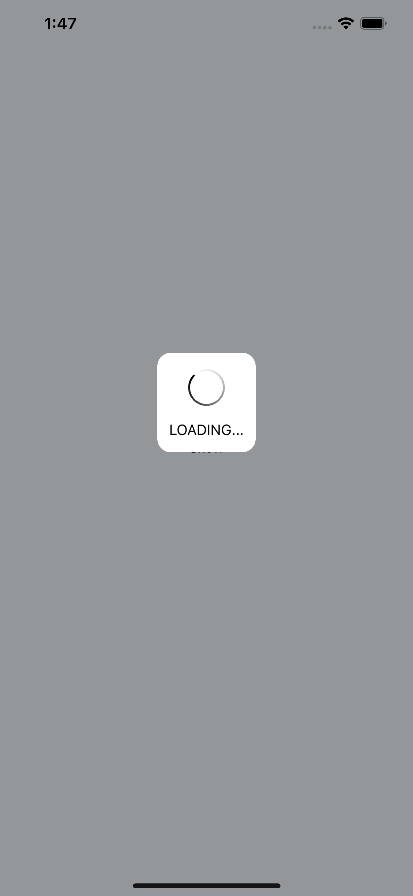
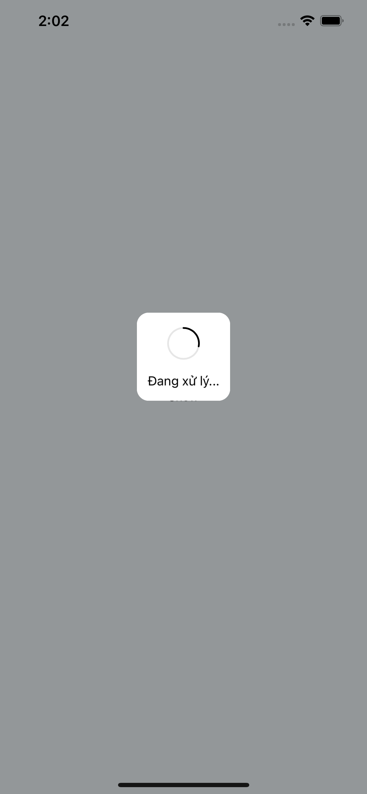
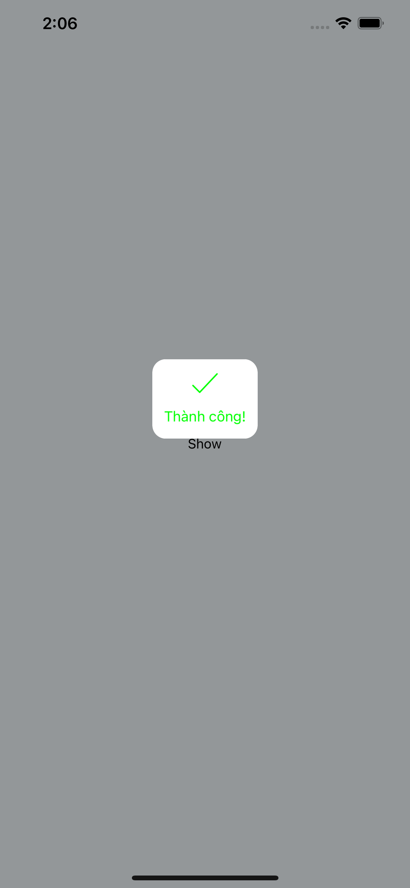
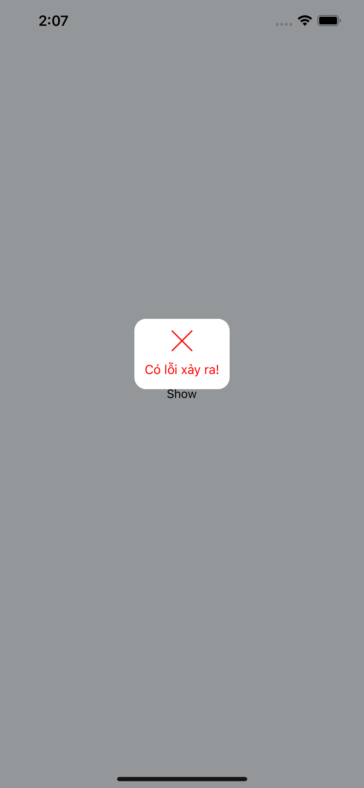
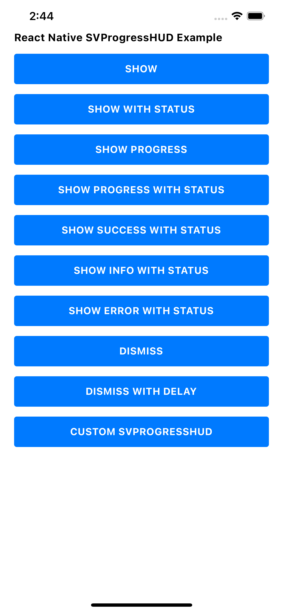

# react-native-svprogresshud

A clean and lightweight progress HUD for react native app, based on SVProgressHUD.

This package migrated from [flutter_svprogresshud](https://github.com/leanflutter/flutter_svprogresshud) to react native based on [create_react_native_module](https://github.com/brodybits/create-react-native-module#readme) package

<p float="left">
    
    
    
    
</p>

## Installation

yarn

`$ yarn add react-native-svprogresshud`

npm

`$ npm install react-native-svprogresshud`

### Mostly automatic installation

`$ react-native link react-native-svprogresshud`

### iOS

`$ npx pod-install`

## Usage

(see demo in `/example`)

`SVProgressHUD` is created as a singleton (i.e. it doesn't need to be explicitly allocated and instantiated; you directly call `SVProgressHUD.method()`).

**Use `SVProgressHUD` wisely! Only use it if you absolutely need to perform a task before taking the user forward. Bad use case examples: pull to refresh, infinite scrolling, sending message.**

Using `SVProgressHUD` in your app will usually look as simple as this:

```jsx
SVProgressHUD.show();
setTimeout(SVProgressHUD.dismiss, 3000);
```

### Showing the HUD

You can show the status of indeterminate tasks using one of the following:

```jsx
SVProgressHUD.show();
SVProgressHUD.show("Trạng thái");
```

If you'd like the HUD to reflect the progress of a task, use one of these:

```jsx
SVProgressHUD.showProgress(0.28);
SVProgressHUD.showProgress(0.96, "Đang xử lý...");
```

### Dismissing the HUD

The HUD can be dismissed using:

```jsx
SVProgressHUD.dismiss();
SVProgressHUD.dismiss(2000);
```

Show a confirmation glyph before before getting dismissed a little bit later. The display time depends on `minimumDismissTimeInterval` and the length of the given string.

```jsx
SVProgressHUD.showInfo("Thông tin.");
SVProgressHUD.showSuccess("Thành công!");
SVProgressHUD.showError("Có lỗi xảy ra!");
```

## API

### Props

- `status` - `string`
- `color` - `array` - `[red, green, blue, alpha]` - `alpha` between `0` and `1` or between `0` and `255`

### Functions

#### `void show(status)`

---

#### `void showProgress(progress, status)`

- `progress` - `number` between `0` and `1`

#### `void dismiss(delay)`

- `delay` - `duration` in milliseconds

#### `void showSuccess(status)`

---

#### `void showInfo(status)`

---

#### `void showError(status)`

---

#### `void setDefaultStyle(style)`

- `style` - default is `"light"`. One of: `"light" || "dark" || "custom"`

---

#### `void setDefaultMaskType(maskType)`

- `style` - default is `"none"`. One of: `"none" || "clear" || "black" || "gradient" || "custom"`

---

#### `void setDefaultAnimationType(type)`

- `style` - default is `"flat"`. One of: `"flat" || "native"`

---

#### `void setMinimumSize(width, height)`

- `width` - default is `0.0`
- `height` - default is `0.0`

---

#### `void setRingThickness(ringThickness)`

- `ringThickness` - default is `2.0`

---

#### `void setRingRadius(radius)`

- `radius` - default is `18.0`

---

#### `void setRingNoTextRadius(radius)`

- `radius` - default is `24.0`

---

#### `void setCornerRadius(radius)`

- `radius` - default is `14.0`

---

#### `void setBorderColor(color)`

---

#### `void setBorderWidth(width)`

- `width` - default is `0.0`

#### `void setForegroundColor(color)`

---

#### `void setForegroundImageColor(color)`

---

#### `void setBackgroundColor(color)`

---

#### `void setBackgroundLayerColor(color)`

---

#### `void setImageViewSize(width, height)`

- `width` - default is `28.0`
- `height` - default is `28.0`

---

#### `void setShouldTintImages(shouldTintImages)`

- `shouldTintImages` - default is `true`

---

#### `void setMinimumDismissTimeInterval(interval)`

- `interval` - default is `5000` milliseconds

---

#### `void setMaximumDismissTimeInterval(interval)`

- `interval` - default is `15000` milliseconds

---

#### `void setFadeInAnimationDuration(interval)`

- `interval` - default is `150` milliseconds

---

#### `void setFadeOutAnimationDuration(interval)`

- `interval` - default is `150` milliseconds

---

#### `void setHapticsEnabled(hapticsEnabled)`

- `interval` - default is `false`

## Running the example app

While developing, you can run the example app to test your changes.


## Setup

- Clone the repository
- Run `yarn` in the root directory to install dependencies, and again in `example`.
- (on iOS) Run `npx pod-install` from the `example` directory

## Start the app

- Run `yarn run:android` to run on Android
- Run `yarn run:ios` to run on iOS

## Related Links

- https://github.com/SVProgressHUD/SVProgressHUD

## License

```
MIT License

Permission is hereby granted, free of charge, to any person obtaining a copy
of this software and associated documentation files (the "Software"), to deal
in the Software without restriction, including without limitation the rights
to use, copy, modify, merge, publish, distribute, sublicense, and/or sell
copies of the Software, and to permit persons to whom the Software is
furnished to do so, subject to the following conditions:

The above copyright notice and this permission notice shall be included in all
copies or substantial portions of the Software.

THE SOFTWARE IS PROVIDED "AS IS", WITHOUT WARRANTY OF ANY KIND, EXPRESS OR
IMPLIED, INCLUDING BUT NOT LIMITED TO THE WARRANTIES OF MERCHANTABILITY,
FITNESS FOR A PARTICULAR PURPOSE AND NONINFRINGEMENT. IN NO EVENT SHALL THE
AUTHORS OR COPYRIGHT HOLDERS BE LIABLE FOR ANY CLAIM, DAMAGES OR OTHER
LIABILITY, WHETHER IN AN ACTION OF CONTRACT, TORT OR OTHERWISE, ARISING FROM,
OUT OF OR IN CONNECTION WITH THE SOFTWARE OR THE USE OR OTHER DEALINGS IN THE
SOFTWARE.
```
